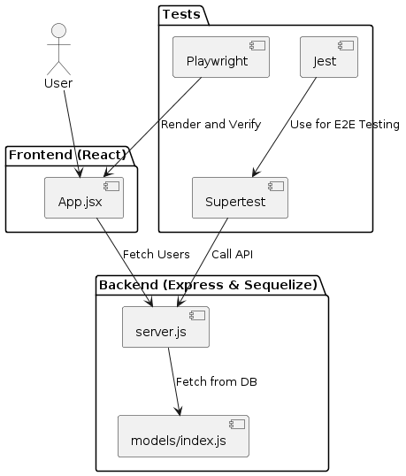

# Playwright-Supertest E2E Testing with Jest

This project demonstrates setting up E2E for both Frontend and Backend all In-Memory and friendly to CI/CD

- Backend e2e test: Express server with Sequelize using an in-memory SQLite database. Test run via jest agains Supertest server without port listening and in memory DB.

- Frontend testing via Playwright hosting react static via serve-static and Mock the API response using Playwright route interception to help call Supertest backend api (in memory backend)

Structure like bellow diagram:

