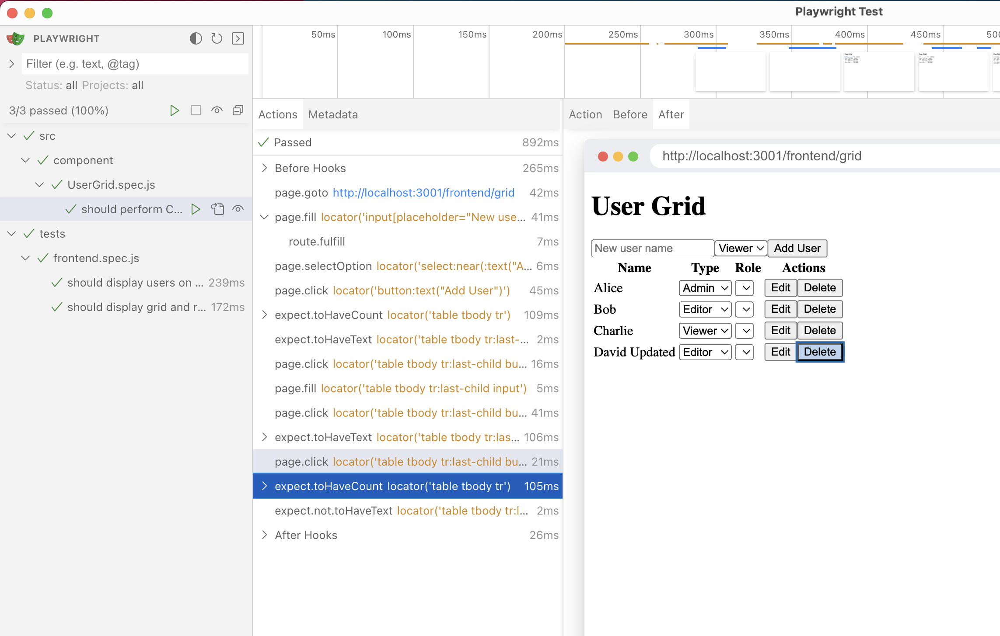

# Full In-Memory E2E Testing for Frontend and Backend

This project demonstrates setting up End-to-End (E2E) tests for both the frontend and backend, all running in-memory, making it friendly for CI/CD pipelines.

- **Backend E2E Test**: An Express server with Sequelize using an in-memory SQLite database. Tests run via Jest against a Supertest server without port listening and using an in-memory database.
- **Frontend Testing**: Uses Playwright to serve a React static site via `serve-static` and mocks the API response using Playwright route interception to call the Supertest backend API (in-memory backend).


## Diagram

Here is a PlantUML diagram to illustrate how this system works:


### Explanation

1. **User** interacts with the **React App**.
2. **React App** fetches user data from the **Express Server**.
3. **Express Server** retrieves user data from the **Sequelize** in-memory SQLite database.
4. **Jest and Supertest** are used for end-to-end testing of the backend.
5. **Playwright** serves the static React app and intercepts API calls to mock responses, enabling frontend testing with an in-memory backend.

## Debugging

### Debug normal via browser (need run backend and frontend separately)


 
## Backend E2E Testing Guide

### Overview

The backend E2E tests are designed to verify the functionality of the Express server and its interaction with the Sequelize in-memory SQLite database. These tests use Jest as the test runner and Supertest to simulate HTTP requests to the server.

### Configuration

- **Sequelize ORM**: Configured to use an in-memory SQLite database.
- **Express Server**: Provides a `/users` endpoint that returns a list of users from the database.
- **Jest**: Configured to run the tests located in the `backend/backend.e2e.js` file.

### Test File: `backend/backend.e2e.js`

**Setup**

1. Clear the database before each test by dropping all tables.
2. Recreate the database schema and insert sample data.

**Tests**

1. Verify that the `/users` endpoint returns the correct list of users.

**backend/backend.e2e.js**:

```javascript
const request = require('supertest');
const app = require('./server');  
const { sequelize, User, clearDatabase } = require('./models');

beforeAll(async () => {
    await clearDatabase();
    await sequelize.sync();
    await User.bulkCreate([
        { name: 'Alice' },
        { name: 'Bob' },
        { name: 'Charlie' },
    ]);
});

afterAll(async () => {
    await sequelize.close();
});

it('should fetch all users', async () => {
    const response = await request(app).get('/users');
    expect(response.status).toBe(200);
    expect(response.body).toHaveLength(3);
    expect(response.body[0].name).toBe('Alice');
    expect(response.body[1].name).toBe('Bob');
    expect(response.body[2].name).toBe('Charlie');
});
```

Run the frontend e2e test via command `npm run test:backend`

### Result of backend e2e


## Frontend E2E Testing Guide

### Overview

The frontend E2E tests are designed to verify the functionality of the React application and its interaction with the backend. These tests use Playwright to automate browser interactions and mock API responses to simulate backend interactions.

### Configuration

- **React**: The frontend is built using Vite and React.
- **Playwright**: Configured to run tests located in the `tests/frontend.spec.js` file and intercept API calls to mock responses.

### Test File: `tests/frontend.spec.js`

**Setup**

1. Serve the built React application using `serve-static`.
2. Use Playwright to mock API responses by intercepting network requests.

**Tests**

1. Verify that the React application correctly displays the list of users fetched from the backend.

**tests/frontend.spec.js**:

```javascript
const { test, expect } = require('@playwright/test');
const app = require('../backend/server'); // Import your backend server
const supertest = require('supertest');
const path = require('path');
const serveStatic = require('serve-static');
const http = require('http');

let request;
let server;

test.beforeAll(async () => {
    // Initialize Supertest with the Express app
    request = supertest(app); 

    // Serve the built React application
    const serve = serveStatic(path.join(__dirname, '../dist'), { index: ['index.html'] });
    server = http.createServer((req, res) => serve(req, res, () => res.end()));
    server.listen(3000, () => {
        console.log('Static file server running on http://localhost:3000');
    });
});

test.afterAll(() => {
    if (server) {
        server.close();
    }
});

test('should display users on the frontend', async ({ page }) => {
    // Mock the API response using Playwright route interception
    await page.route('**/users', async (route) => {
        console.log('Route Intercepted: ', route.request().url());
        const response = await request.get('/users');
        console.log('Intercepted request response:', response.body);
        route.fulfill({
            status: 200,
            contentType: 'application/json',
            body: JSON.stringify(response.body)
        });
    });

    // Navigate to the static file server
    await page.goto('http://localhost:3000');

    // Wait for the users to be rendered
    await page.waitForSelector('ul#user-list li');

    // Verify that the users are displayed correctly
    const userElements = await page.locator('ul#user-list li');
    const userNames = await userElements.allInnerTexts();
    console.log('User names in the DOM:', userNames);
    expect(userNames).toEqual(['Alice', 'Bob', 'Charlie']);
});
```

Run the frontend e2e test via command `npm run test:frontend:playwright`

### Result of frontend e2e without ui


Run the frontend e2e test with ui via command `npm run test:frontend:playwright:ui`

### Result of frontend e2e with web UI




## License

This project is licensed under the MIT License.
